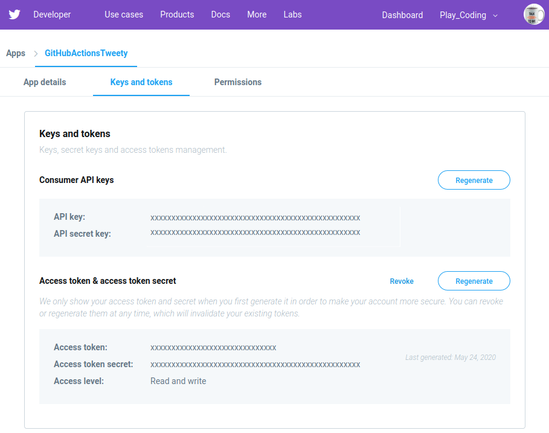
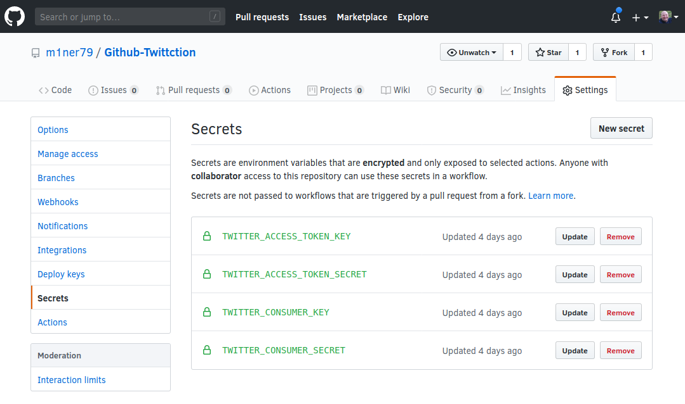

# Create a twitter app

You can create a twitter app for your twitter account at https://developer.twitter.com/en/apps.

If you haven’t yet, you will be asked to apply for a Twitter developer account. See my answers below for reference. If you’ve done that before, skip the next section and continue at [Create an app](#create-an-app).

## Apply for a developer account

You might be asked to add a phone number to your twitter account before proceeding. If the phone number is used in another account, it won’t let you use it again. But you can remove the phone number from the other account. You can change it back once your developer account was approved.

### Who are you requesting access for?

    ( ) I am requesting access for my organization
    (x) I am requesting access for my own personal use

### Account name

The twitter account name of your project.

### Primary country of operation

I think that this is straight forward.

### What use case(s) are you interested in?

Here you need to select what is most aplicable to you.

    [ ] Academic research
    [ ] Advertising
    [ ] Audience analysis
    [ ] Chatbots and automation
    [ ] Consumer / end-user experience
    [ ] Engagement and customer service
    [ ] Publish and curate Tweets
    [x] Student project / Learning to code
    [ ] Topic analysis
    [ ] Trend and event detection
    [ ] Other

### Describe in your own words what you are building

#### 1. What is the core use case, intent, or purpose for your use of Twitter's APIs?

This action supports every github event. Currently the app publish default messages to twitter when one of these GitHub events will trigger: 
* push
* pull_request
* release

#### 2. Do you intend to analyze Tweets, Twitter users, or their content? If so, share details about the analyses you plan to conduct and the methods or techniques you plan to use.

When you are not sure, then you probably are better to select "No".

#### 3. Does your use case involve Tweeting, Retweeting, or liking content? If so, share how you will interact with Twitter users or their content.

Yes. This app will be used to post tweets for this account. Maybe in the future more options will be introduced.

#### 4. How will Twitter data be displayed to users of your solution? If you plan to display Twitter content off of Twitter, explain how and where Tweets and Twitter content will be displayed to users of your product or service. Will individual Tweets and Twitter content be displayed, or will information about Tweets or Twitter content be displayed in aggregate?

No twitter data will be displayed. The `Github-Twittction` GitHub action shows a preview of the tweet before it is published and becomes twitter data.

### Will your product, service, or analysis make Twitter content or derived information available to a government entity?

No

---

You will receive an email to verify your developer account. After that you can create an app at https://developer.twitter.com/en/apps/create.

## Create an app

Only 4 questions are required. Here are my answers for reference

### App name (required)

 e.g. `GitHubActionsTweety`

### Application description (required)

This application will post default message on twitter every time one off these github events will trigger: push, pull_request, release.

### Website URL (required)

https://github.com/m1ner79/Github-Twittction

### Tell us how this app will be used (required)

This app will will allow user to create a custom message to post on twitter or use our default messages.

## Save credentials

Open your app’s "Keys and tokens" tab. In the "Access token & access token secret" section, press the "Create" button. After that you will see all four credentials required for `Github-Twittction`

Now save the credentials into your repository’s "Secrets" settings as follows

| Twitter Credential name | GitHub Secret name            |
| ----------------------- | ----------------------------- |
| API key                 | `TWITTER_API_KEY`             |
| API secret key          | `TWITTER_API_SECRET_KEY`      |
| Access token            | `TWITTER_ACCESS_TOKEN`        |
| Access token secret     | `TWITTER_ACCESS_TOKEN_SECRET` |

